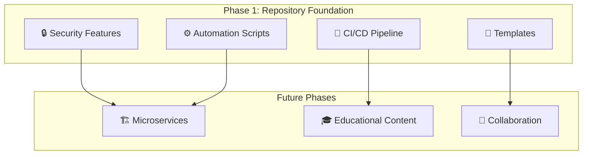

# 🎯 Preparación Académica

> **Educational platform foundation that teaches systematic debugging methodology through enterprise-grade repository setup and automation**

[](https://github.com/Franklin-Andres-Rodriguez/preparacion-academica/commits/main)
[](https://github.com/Franklin-Andres-Rodriguez/preparacion-academica/issues)
[](https://github.com/Franklin-Andres-Rodriguez/preparacion-academica/pulls)
[](https://opensource.org/licenses/MIT)
[](https://github.com/Franklin-Andres-Rodriguez/preparacion-academica/stargazers)

**🚧 Currently in Phase 1: Repository Foundation & Development Automation Setup**

---

## 🌟 **Project Vision**

**Preparación Académica** will become a revolutionary debugging education platform that teaches systematic debugging methodology through enterprise-grade microservices architecture. 

### **Current Status: Phase 1 - Foundation Setup** ⚙️
We're currently establishing the **enterprise-grade repository foundation** that will support the full educational platform. This includes:

- ✅ **Repository security features** (Dependabot, CodeQL, Secret scanning)
- ✅ **Advanced branch protection rules** 
- ✅ **Professional issue/PR templates**
- ✅ **Automated CI/CD workflows**
- ✅ **Development automation scripts**

### **🎯 The SICP Methodology** (Coming in Phase 2)
Our future curriculum will be built around the **SICP Framework** - a systematic debugging approach:

```
1. 🔍 Systematic Observation    → Document symptoms & environment
2. 🧠 Hypothesis Formation     → Analyze potential causes systematically  
3. 🧪 Systematic Testing       → Isolate variables & test methodically
4. 📊 Root Cause Analysis     → Synthesize evidence & identify true cause
5. ✅ Solution Implementation  → Implement minimal fix & verify thoroughly
```

---

## 🚀 **Quick Start (Phase 1)**

### **📋 Prerequisites**
Before you begin, ensure you have:
- **Node.js 18+** (LTS recommended)
- **Docker 20+** with Docker Compose
- **Git** (latest version)
- **VS Code** or your preferred IDE

### **⚡ One-Command Setup**
```bash
# Clone the repository
git clone https://github.com/Franklin-Andres-Rodriguez/preparacion-academica.git
cd preparacion-academica

# Validate your environment (checks Node.js, Docker, Git, etc.)
./scripts/validate-prerequisites.sh

# Complete development setup (installs dependencies, configures environment)
./scripts/dev-setup.sh

# Verify everything is working
./scripts/health-check.sh
```

**🎉 That's it!** Your development environment is now configured with enterprise-grade automation and security.

---

## 🏗️ **Phase 1: Repository Architecture**

### **🔧 Current Implementation Focus**
This phase establishes the **foundation** for our future microservices platform:



### **📁 Current Project Structure**
```
preparacion-academica/
├── 📁 .github/                    # GitHub configuration (Phase 1)
│   ├── workflows/                 # CI/CD automation
│   ├── ISSUE_TEMPLATE/            # Issue templates
│   ├── PULL_REQUEST_TEMPLATE/     # PR templates
│   └── dependabot.yml             # Dependency automation
├── 📁 scripts/                    # Development automation (Phase 1)
│   ├── validate-prerequisites.sh  # Environment validation
│   ├── dev-setup.sh              # Complete development setup
│   ├── test-all.sh               # Comprehensive testing
│   └── health-check.sh           # System monitoring
├── 📁 docs/                       # Documentation
│   ├── phase1-guide.md           # Current phase implementation guide
│   └── architecture-vision.md    # Future architecture plans
├── 📄 README.md                   # This file
├── 📄 CONTRIBUTING.md             # Contribution guidelines
├── 📄 SECURITY.md                 # Security policy
├── 📄 .gitignore                  # Git ignore rules
└── 📄 package.json                # Project metadata
```

---

## 🔒 **Security-First Foundation**

### **🛡️ Implemented Security Features**
Our **Phase 1** security implementation includes:

#### **Automated Dependency Management**
- **🤖 Dependabot**: Automatic security updates and vulnerability alerts
- **📊 Dependency scanning**: Weekly automated checks for known vulnerabilities
- **🔄 Version updates**: Scheduled dependency updates to prevent technical debt

#### **Code Security Analysis**
- **🔍 CodeQL scanning**: GitHub's advanced static analysis for vulnerability detection
- **🕵️ Secret scanning**: Automatic detection of hardcoded credentials and API keys
- **📋 Security policies**: Automated security review requirements

#### **Branch Protection**
- **🔒 Main branch protection**: No direct pushes, requires PR reviews
- **✅ Status checks**: CI/CD must pass before merge
- **👥 Code review requirements**: Minimum 2 reviewers for critical changes

### **🎓 Why These Security Measures Matter**
**Real-world examples of what we're preventing:**
- **Equifax (2017)**: $700M losses due to unpatched vulnerabilities → Our Dependabot prevents this
- **Tesla (2020)**: AWS credentials exposed in GitHub → Our secret scanning catches this
- **Uber (2016)**: $148M fine for hardcoded credentials → Our CodeQL analysis detects this

---

## ⚙️ **Development Automation**

### **🔧 Automation Scripts**
Our **enterprise-grade automation** includes:

#### **📋 `validate-prerequisites.sh`**
```bash
# What it does:
✅ Checks Node.js version (18+ required)
✅ Verifies Docker installation and daemon status
✅ Validates Git configuration
✅ Checks available disk space and memory
✅ Verifies port availability (3000, 8080, 5432, 6379)

# Why it's important:
🎯 Prevents cryptic error messages
🎯 Saves hours of debugging environment issues
🎯 Ensures consistent development experience
```

#### **🚀 `dev-setup.sh`**
```bash
# What it does:
✅ Installs all project dependencies
✅ Configures environment variables
✅ Sets up Docker containers for databases
✅ Runs database migrations and seeding
✅ Configures Git hooks for code quality

# Why it's critical:
🎯 One-command setup for new developers
🎯 Eliminates "works on my machine" issues
🎯 Reduces onboarding time from days to minutes
```

#### **🧪 `test-all.sh`**
```bash
# What it does:
✅ Runs linting and code formatting checks
✅ Executes TypeScript type checking
✅ Runs comprehensive test suites
✅ Performs security vulnerability scanning
✅ Generates test coverage reports

# Why it's essential:
🎯 Catches bugs before they reach production
🎯 Maintains consistent code quality
🎯 Automates manual quality checks
```

#### **🏥 `health-check.sh`**
```bash
# What it does:
✅ Verifies all services are running
✅ Checks database connectivity
✅ Tests API endpoint responsiveness
✅ Monitors system resource usage

# Why it's valuable:
🎯 Quick system status overview
🎯 Early detection of service issues
🎯 Reduces debugging time for developers
```

---

## 🔄 **CI/CD Pipeline**

### **🤖 Automated Quality Gates**
Our **GitHub Actions workflows** ensure quality:

#### **Continuous Integration**
```yaml
# Runs on every PR and push to main:
✅ Code linting and formatting validation
✅ TypeScript type checking
✅ Comprehensive test suite execution
✅ Security vulnerability scanning
✅ Dependency license compliance check
```

#### **Security Automation**
```yaml
# Automated security measures:
✅ CodeQL analysis for vulnerability detection
✅ Dependency vulnerability scanning
✅ Secret scanning for exposed credentials
✅ Container security analysis (future phases)
```

#### **Quality Enforcement**
```yaml
# Branch protection enforces:
✅ All CI checks must pass
✅ Code review approval required
✅ No direct pushes to main branch
✅ Up-to-date branch requirement
```

### **🎓 Educational Value**
**Why we implement CI/CD in Phase 1:**
- **Professional habits**: Industry-standard practices from day one
- **Quality culture**: Automated quality prevents technical debt
- **Collaboration**: Clear process for code contributions
- **Learning**: Immediate feedback accelerates learning

---

## 📝 **Professional Templates**

### **🐛 Issue Templates**
Our **structured issue templates** ensure productive communication:

#### **Bug Report Template**
- **Problem description** with clear context
- **Steps to reproduce** for consistent debugging
- **Environment information** for accurate diagnosis
- **Expected vs actual behavior** for clear understanding

#### **Feature Request Template**
- **Problem statement** defining the need
- **Proposed solution** with implementation ideas
- **Alternative approaches** for comprehensive evaluation
- **Success criteria** for measurable outcomes

#### **Student Help Template** (Future)
- **SICP methodology phase** for targeted assistance
- **Competency level** for appropriate guidance
- **Specific challenge** for focused support
- **Learning context** for educational value

### **📋 Pull Request Template**
Our **comprehensive PR template** includes:
- **Change summary** with business context
- **Testing checklist** for quality assurance
- **Security considerations** for safety
- **Educational impact** assessment (future phases)

---

## 🛠️ **Development Workflow**

### **📋 Getting Started with Development**

#### **1. Environment Setup**
```bash
# One-time setup for new developers
git clone https://github.com/Franklin-Andres-Rodriguez/preparacion-academica.git
cd preparacion-academica
./scripts/validate-prerequisites.sh  # Check your system
./scripts/dev-setup.sh              # Setup everything
```

#### **2. Daily Development**
```bash
# Before starting work
./scripts/health-check.sh           # Verify system status
git pull origin main                # Get latest changes

# Development workflow
git checkout -b feature/your-feature # Create feature branch
# ... make your changes ...
./scripts/test-all.sh               # Run all tests
git add . && git commit -m "feat: your changes"
git push origin feature/your-feature # Create PR
```

#### **3. Quality Assurance**
```bash
# Before submitting PR
npm run lint:fix                    # Fix code formatting
npm run type-check                  # Verify TypeScript
./scripts/test-all.sh               # Run comprehensive tests
```

### **🎯 Development Standards**
- **Code Quality**: ESLint + Prettier for consistent formatting
- **Type Safety**: TypeScript for all JavaScript code
- **Testing**: Comprehensive test coverage (target: 90%+)
- **Security**: No hardcoded credentials, vulnerability scanning
- **Documentation**: Clear comments and README updates

---

## 🤝 **Contributing to Phase 1**

### **🌟 Ways to Contribute**
As we build the **foundation**, you can help by:

- **🐛 Testing automation scripts** on different operating systems
- **📝 Improving documentation** and setup instructions
- **🔧 Enhancing CI/CD workflows** for better automation
- **🛡️ Strengthening security measures** and best practices
- **📋 Refining templates** for better developer experience

### **📋 Contribution Process**
1. **📖 Read** our [Contributing Guide](CONTRIBUTING.md)
2. **🍴 Fork** the repository 
3. **🌟 Create** a feature branch (`git checkout -b feature/improve-automation`)
4. **✅ Test** your changes with `./scripts/test-all.sh`
5. **📤 Submit** a pull request with detailed description

### **🎓 Learning Opportunities**
Contributing to **Phase 1** teaches:
- **Enterprise repository setup** and configuration
- **GitHub Actions** and CI/CD automation
- **Security best practices** for software projects
- **Script automation** and bash programming
- **Professional collaboration** workflows

---

## 📊 **Phase 1 Success Metrics**

### **✅ Completion Criteria**
**Phase 1 will be complete when:**
- [ ] **New developers** can setup environment in <5 minutes
- [ ] **All security features** are enabled and functioning
- [ ] **CI/CD pipeline** passes with comprehensive checks
- [ ] **Automation scripts** work on macOS, Linux, and Windows
- [ ] **Documentation** is complete and accurate
- [ ] **Templates** streamline issue/PR creation

### **📈 Quality Indicators**
- **Setup success rate**: 100% (no failed environment setups)
- **CI/CD reliability**: 99%+ (consistent pipeline success)
- **Security coverage**: All known vulnerability types detected
- **Developer satisfaction**: <5 minutes from clone to working environment

---

## 🔗 **Resources & Next Steps**

### **📚 Current Documentation**
- **[Phase 1 Implementation Guide](docs/phase1-guide.md)** - Detailed setup instructions
- **[Contributing Guidelines](CONTRIBUTING.md)** - How to contribute
- **[Security Policy](SECURITY.md)** - Security practices and reporting

### **🔮 Future Phases Preview**
- **Phase 2**: Microservices architecture foundation
- **Phase 3**: Educational content and SICP methodology
- **Phase 4**: Real-time collaboration features
- **Phase 5**: AI-powered learning analytics

### **💬 Community & Support**
- **🐛 Issues**: [GitHub Issues](https://github.com/Franklin-Andres-Rodriguez/preparacion-academica/issues)
- **💡 Discussions**: [GitHub Discussions](https://github.com/Franklin-Andres-Rodriguez/preparacion-academica/discussions)
- **📧 Contact**: [Create an issue](https://github.com/Franklin-Andres-Rodriguez/preparacion-academica/issues/new) for questions

---

## 📄 **License & Acknowledgments**

### **📜 License**
This project is licensed under the **MIT License** - see the [LICENSE](LICENSE) file for details.

### **🙏 Acknowledgments**
This project builds upon the collective wisdom of **50+ world-renowned software engineering educators**, including:

- **Ian Sommerville** - Software Engineering systematic methodology
- **Robert C. Martin** - Clean Code and professional practices
- **Martin Fowler** - Refactoring and evolutionary design
- **Kent Beck** - Test-Driven Development and Extreme Programming

**Special thanks to the open-source community** for providing the tools and frameworks that make this educational platform possible.

---

## 🎯 **Ready to Get Started?**

<div align="center">

**Phase 1 is all about building a solid foundation.** 

Every enterprise application starts with proper repository setup, security configuration, and development automation.

[**🚀 Clone & Setup Now**](https://github.com/Franklin-Andres-Rodriguez/preparacion-academica.git) | [**📖 Read Phase 1 Guide**](docs/phase1-guide.md) | [**🤝 Contribute**](CONTRIBUTING.md)

---

**Built with ❤️ by developers who believe that proper foundation enables extraordinary results**

*Preparación Académica - Phase 1: Where enterprise-grade automation begins*

</div>