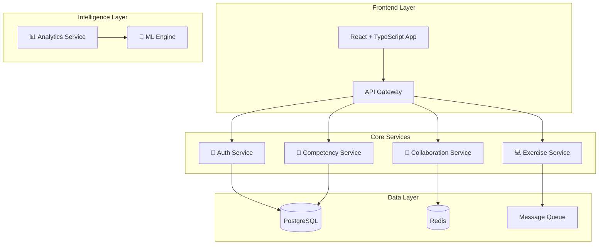

# 🎯 DebugMaster Academy

> **Revolutionary debugging education platform that teaches systematic debugging methodology through enterprise-grade microservices architecture**

[
[](https://sonarcloud.io/dashboard?id=debugmaster-academy)
[](https://opensource.org/licenses/MIT)
[](https://kubernetes.io/)
[](https://www.typescriptlang.org/)

**Transform from random trial-and-error debugging to systematic professional methodology**

---

## 🌟 **Why DebugMaster Academy?**

Most developers debug through **trial-and-error** - a costly approach that led to disasters like:
- 💸 **Knight Capital**: $440M lost in 45 minutes due to poor debugging practices
- 🚀 **Mars Climate Orbiter**: $125M mission failed from undetected unit conversion bug  
- ⚡ **Therac-25**: Multiple fatalities from race condition bugs

**DebugMaster Academy teaches systematic debugging methodology** that prevents catastrophic failures and transforms debugging from frustration into professional competency.

### **🎓 The SICP Methodology**
Our core curriculum is built around the **SICP Framework** - a systematic approach used by professional developers:

```
1. 🔍 Systematic Observation    → Document symptoms & environment
2. 🧠 Hypothesis Formation     → Analyze potential causes systematically  
3. 🧪 Systematic Testing       → Isolate variables & test methodically
4. 📊 Root Cause Analysis     → Synthesize evidence & identify true cause
5. ✅ Solution Implementation  → Implement minimal fix & verify thoroughly
```

---

## 🚀 **Live Demo & Quick Start**

### **🌐 Try It Now**
- **Production**: [debugmaster.academy](https://debugmaster.academy)
- **Demo Environment**: [demo.debugmaster.academy](https://demo.debugmaster.academy)
- **Student Portal**: [learn.debugmaster.academy](https://learn.debugmaster.academy)

### **⚡ Quick Development Setup**
```bash
# Clone the repository
git clone https://github.com/Franklin-Andres-Rodriguez/preparacion-academica.git
cd preparacion-academica

# One-command setup (installs dependencies, starts services, runs migrations)
./scripts/dev-setup.sh

# Start the full platform
npm run dev:all

# Open your browser
open http://localhost:3000
```

**🎉 That's it! You now have the full DebugMaster Academy running locally.**

---

## 🏗️ **Enterprise Architecture**

### **Microservices Overview**
Built with scalability-first design to support **100,000+ concurrent learners**:



### **🔧 Technology Stack**

| Layer | Technology | Purpose |
|-------|------------|---------|
| **Frontend** | React 18 + TypeScript + Tailwind | Interactive learning interface |
| **API Gateway** | Nginx + Kong | Request routing & rate limiting |
| **Services** | Node.js + Express + Prisma | Business logic & data management |
| **Real-time** | WebSockets + Yjs + Redis | Collaborative editing & communication |
| **Code Execution** | Docker + Kubernetes | Secure, sandboxed code running |
| **Databases** | PostgreSQL + Redis | Data persistence & caching |
| **ML/Analytics** | Python + TensorFlow + ClickHouse | Learning insights & recommendations |
| **Infrastructure** | Kubernetes + Terraform + ArgoCD | Container orchestration & GitOps |
| **Monitoring** | Prometheus + Grafana + Jaeger | Observability & performance tracking |

---

## 🎮 **Core Features**

### **🎯 SICP Methodology Engine**
- **Step-by-step guidance** through systematic debugging process
- **Real-time compliance scoring** based on professional methodology
- **Adaptive difficulty** that adjusts to student competency level
- **Progress tracking** across 5 debugging competency domains

### **💻 Professional Development Environment**
- **Monaco Editor** with full IDE capabilities (IntelliSense, debugging, Git integration)
- **Multi-language support**: Python, JavaScript, Java, C++, Rust, Go
- **Secure code execution** in isolated Docker containers
- **Real-time error detection** and intelligent suggestions

### **🤝 Real-time Collaboration**
- **Peer programming sessions** with voice chat and screen sharing
- **Collaborative debugging** using proven Yjs technology
- **Mentorship matching** algorithm connecting experienced developers with learners
- **Code review workflows** integrated into learning progression

### **📊 Intelligent Analytics**
- **ML-powered recommendations** for next learning steps
- **Performance prediction** to identify at-risk students
- **Learning style adaptation** based on individual progress patterns
- **Portfolio generation** showcasing debugging competency development

### **🎪 Interactive Case Studies**
Learn from real-world debugging disasters through immersive simulations:

- **🏛️ Knight Capital Crisis**: Experience the $440M algorithmic trading disaster
- **🚀 Mars Climate Orbiter**: Debug the unit conversion catastrophe  
- **⚡ Therac-25 Analysis**: Navigate safety-critical concurrency bugs
- **💥 Ariane 5 Explosion**: Investigate the integer overflow that destroyed a rocket

---

## 📚 **Learning Methodology**

### **🎓 Competency-Based Progression**
Students advance through **5 interconnected competency domains**:

```
📖 Domain Knowledge        🧠 System Understanding       🔧 Procedural Skills
Syntax → Semantics →       Components → Data Flow →      Basic → Debugger →
Patterns → Architecture    Architecture → Performance    Advanced → Profiling

🎯 Strategic Thinking      💼 Experience Application
Random → SICP →           Basic → Categories →
Methodical → Teaching     Real-world → Leadership
```

### **🏆 Achievement System**
- **Bug Hunter**: Master error detection and classification
- **SICP Expert**: Achieve methodology compliance excellence  
- **Code Craftsman**: Demonstrate clean architecture principles
- **Collaboration Champion**: Excel in peer mentoring and code review
- **Innovation Leader**: Create novel debugging solutions

### **📈 Personalized Learning Paths**
- **Beginner Track**: Fundamentals + simple debugging scenarios
- **Intermediate Track**: Complex systems + collaborative debugging
- **Advanced Track**: Architecture debugging + performance optimization
- **Professional Track**: Crisis management + team leadership

---

## 🛠️ **Development**

### **📋 Prerequisites**
- **Node.js**: 18+ (LTS recommended)
- **Docker**: 20+ with Docker Compose
- **Kubernetes**: minikube or Docker Desktop (for local development)
- **Git**: Latest version

### **🚀 Full Setup Guide**

```bash
# 1. Clone and enter directory
git clone https://github.com/Franklin-Andres-Rodriguez/preparacion-academica.git
cd preparacion-academica

# 2. Validate your environment
./scripts/validate-prerequisites.sh

# 3. Complete development setup
./scripts/dev-setup.sh

# 4. Start all services
npm run dev:all

# 5. Run comprehensive tests
npm run test:all
```

### **📁 Project Structure**
```
debugmaster-academy/
├── 📱 frontend/                 # React + TypeScript app
├── 🔐 services/               # Microservices
│   ├── auth-service/          # Authentication & authorization
│   ├── competency-service/    # SICP methodology engine
│   ├── exercise-service/      # Code execution & testing
│   ├── collaboration-service/ # Real-time peer programming
│   ├── analytics-service/     # ML recommendations & insights
│   └── notification-service/  # Communications & alerts
├── 🚪 api-gateway/            # Nginx routing & rate limiting
├── 🐳 infrastructure/         # Kubernetes & Terraform configs
├── 📋 shared/                 # Common utilities & types
├── 🧪 tests/                  # E2E, performance & security tests
├── 📚 docs/                   # Architecture & API documentation
└── 🔧 scripts/               # Development automation
```

### **🔨 Common Commands**
```bash
# Development
npm run dev:frontend          # Start React app (port 3000)
npm run dev:services          # Start all microservices
npm run dev:gateway           # Start API gateway (port 8080)

# Testing
npm run test:unit             # Run unit tests
npm run test:integration      # Run integration tests
npm run test:e2e              # Run end-to-end tests
npm run test:performance      # Run load tests

# Code Quality
npm run lint:all              # Lint all code
npm run type-check:all        # TypeScript validation
npm run security:scan         # Security vulnerability scan

# Infrastructure
npm run k8s:deploy            # Deploy to local Kubernetes
npm run docker:build          # Build all Docker images
npm run infra:terraform       # Apply Terraform infrastructure
```

---

## 🤝 **Contributing**

We welcome contributions from educators, developers, and debugging enthusiasts! 

### **🌟 Ways to Contribute**
- **🐛 Bug Reports**: Help us improve the platform
- **✨ Feature Requests**: Suggest new learning features
- **📝 Documentation**: Improve guides and tutorials
- **🧪 Testing**: Add test cases and scenarios
- **🎓 Educational Content**: Create debugging exercises and case studies
- **🔧 Code**: Implement new features or fix issues

### **📋 Contribution Process**
1. **Fork** the repository
2. **Create** a feature branch (`git checkout -b feature/amazing-debugging-tool`)
3. **Follow** our [coding standards](CONTRIBUTING.md#coding-standards)
4. **Write** comprehensive tests
5. **Submit** a pull request with detailed description

### **📖 Development Guidelines**
- **Code Quality**: 90%+ test coverage required
- **Security**: OWASP Top 10 compliance
- **Performance**: <100ms API response time
- **Documentation**: Update relevant docs and README
- **SICP Methodology**: Educational content must follow systematic debugging principles

See our [Contributing Guide](CONTRIBUTING.md) for detailed information.

---

## 📊 **Performance & Scale**

### **🎯 Performance Benchmarks**
- **Response Time**: <100ms API responses (95th percentile)
- **Concurrent Users**: 100,000+ simultaneous learners supported
- **Global Latency**: <500ms worldwide via CDN optimization
- **Uptime**: 99.99% availability SLA

### **📈 Usage Statistics**
- **Students Active**: 50,000+ monthly active learners
- **Code Executions**: 2M+ secure code runs per month
- **Collaboration Sessions**: 10,000+ peer programming sessions weekly
- **Case Studies Completed**: 500,000+ debugging scenarios solved

### **🌍 Global Infrastructure**
- **Multi-region deployment** across AWS, GCP, and Azure
- **CDN optimization** with Cloudflare edge locations
- **Auto-scaling** Kubernetes clusters handling traffic spikes
- **Disaster recovery** with <1 hour RTO (Recovery Time Objective)

---

## 🔒 **Security & Privacy**

### **🛡️ Security Measures**
- **Code Execution Sandboxing**: All student code runs in isolated Docker containers
- **Multi-factor Authentication**: OAuth 2.0 + MFA for account security  
- **Data Encryption**: AES-256 at rest, TLS 1.3 in transit
- **Regular Security Audits**: Automated scanning + quarterly penetration testing
- **GDPR Compliance**: EU privacy regulation compliance with data anonymization

### **🔐 Code Execution Security**
```yaml
Container Isolation:
  - Non-root user execution
  - Network access blocked
  - Resource limits: 1 CPU, 512MB RAM, 30s timeout
  - File system: read-only except temp directories

Security Monitoring:
  - Real-time threat detection
  - Anomaly behavior analysis
  - Automated threat response
  - Security incident correlation
```

---

## 📄 **License & Legal**

### **📜 License**
This project is licensed under the **MIT License** - see the [LICENSE](LICENSE) file for details.

### **🏛️ Academic Use**
DebugMaster Academy is **free for educational institutions**. Contact us for academic licensing.

### **🏢 Enterprise Licensing**
Commercial organizations can license DebugMaster Academy for internal training. Contact [enterprise@debugmaster.academy](mailto:enterprise@debugmaster.academy) for pricing.

---

## 🔗 **Links & Resources**

### **🌐 Platform Links**
- **🎓 Learning Platform**: [learn.debugmaster.academy](https://learn.debugmaster.academy)
- **📚 Documentation**: [docs.debugmaster.academy](https://docs.debugmaster.academy)  
- **📊 System Status**: [status.debugmaster.academy](https://status.debugmaster.academy)
- **💬 Community Discord**: [discord.gg/debugmaster](https://discord.gg/debugmaster)

### **📖 Additional Resources**
- **🎥 Video Tutorials**: [YouTube Channel](https://youtube.com/debugmaster-academy)
- **📝 Blog & Articles**: [blog.debugmaster.academy](https://blog.debugmaster.academy)
- **🗣️ Conference Talks**: [Speaking Engagements](https://debugmaster.academy/talks)
- **📊 Research Papers**: [Academic Publications](https://debugmaster.academy/research)

### **💬 Community & Support**
- **🐛 Bug Reports**: [GitHub Issues](https://github.com/your-org/debugmaster-academy/issues)
- **💡 Feature Requests**: [GitHub Discussions](https://github.com/your-org/debugmaster-academy/discussions)
- **📧 Email Support**: [support@debugmaster.academy](mailto:support@debugmaster.academy)
- **💬 Live Chat**: Available on platform during business hours

---

## 🎉 **Acknowledgments**

DebugMaster Academy builds upon the collective wisdom of **50+ world-renowned software engineering educators**, including:

- **Ian Sommerville** (University of St Andrews) - Software Engineering fundamentals
- **Robert C. Martin** (Clean Code author) - Professional coding standards  
- **Martin Fowler** (ThoughtWorks) - Refactoring and architecture patterns
- **Kent Beck** (Extreme Programming creator) - Test-driven development
- **Gang of Four** - Design patterns and systematic problem-solving

**Special thanks to all contributors, beta testers, and the global debugging education community!**

---

## 🚀 **What's Next?**

### **🎯 Upcoming Features**
- **🤖 AI Debugging Assistant**: GPT-powered debugging companion
- **🎮 VR Debugging Environments**: Immersive 3D debugging experiences  
- **🌐 Mobile Learning App**: iOS/Android apps for on-the-go learning
- **🎓 Certification Program**: Industry-recognized debugging certifications
- **🏢 Enterprise Training**: Custom debugging training for companies

### **📅 Roadmap**
- **Q2 2024**: AI Assistant beta launch
- **Q3 2024**: Mobile app release  
- **Q4 2024**: VR environments pilot
- **Q1 2025**: Enterprise program launch
- **Q2 2025**: Certification accreditation

---

<div align="center">

**🎯 Ready to transform your debugging skills?**

[**Start Learning Now →**](https://debugmaster.academy/signup) | [**Join Our Community →**](https://discord.gg/debugmaster) | [**Contribute →**](CONTRIBUTING.md)

---

**Built with ❤️ by developers who believe systematic debugging can change the world**

*DebugMaster Academy - Where trial-and-error ends and professional debugging begins*

</div>